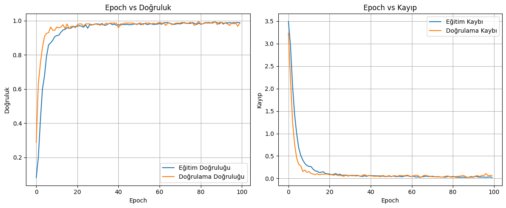

# Karakter Tabanlı Plaka Tanıma (CNN ile)

Bu proje, CNN (Convolutional Neural Network) kullanarak görsel bir plaka üzerindeki karakterleri otomatik olarak tanıyan bir yapay zekâ sistemidir.

## 📌 Özellikler

- Gri tonlamalı görseller üzerinden eğitim
- Karakterleri segmentleyip her birini ayrı ayrı tanıma
- Eğitim ve doğrulama istatistiklerini görselleştirme
- Eğitilen model `.h5` formatında kaydedilir
- Label Encoder `.pkl` dosyasına kaydedilir
- Segmentasyon sonrası karakterler ve debug görselleri `debug_chars/` klasörüne yazılır

---

## 🔍 Eğitim Sonuçları

Aşağıdaki grafik, modelin 100 epoch süresince eğitim ve doğrulama doğruluklarını ve kayıplarını göstermektedir:

---

## 🧠 Kullanılan Teknolojiler

- Python
- OpenCV
- TensorFlow / Keras
- NumPy
- scikit-learn
- Matplotlib

---
### ⚠️ Notlar
Model küçük boyutlu görseller için optimize edilmiştir (28x28).

Gürültülü görsellerde karakter ayrıştırmada hatalar olabilir.

debug_chars/ klasörü segmentasyon sonucunu anlamak için önemlidir.

